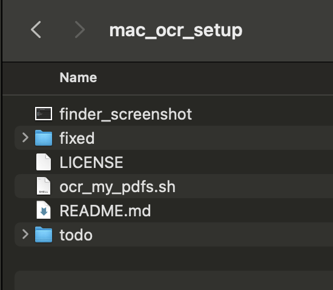

# mac_ocr_setup
Quick and Dirty Setup to Batch Process PDF OCRs on Mac

Commands given in boxes such as
```sh
ls -hal
```
should be run from the Mac [Terminal](https://support.apple.com/guide/terminal/welcome/mac) app

## Step 1: Install [Homebrew](https://brew.sh)

This is a Mac software download application that allows for command-line tools to be installed 

Run the command that is also given on the Homebrew homepage
```sh
/bin/bash -c "$(curl -fsSL https://raw.githubusercontent.com/Homebrew/install/HEAD/install.sh)"
```

Be sure to run the two follow up commands that home brew reccomends after it installs! These will be unique to your system


## Step 2: Install [ocrmypdf](https://github.com/ocrmypdf/OCRmyPDF)

Use Homebrew to install ocrmypdf

```sh
brew install ocrmypdf
```

## Step 3: Download this repo

Either use the Git source management tool:
```sh
git clone https://github.com/inmcm/mac_ocr_setup.git
```

or [download](https://github.com/inmcm/mac_ocr_setup/archive/refs/heads/main.zip) and extract it:
```sh
unzip main.zip
```
(you can also double click the zip file in finder and it will extract it)

### Step 4: Prepare you input PDFs

However you downloaded this repo there will be several things inside the folder


Copy all the PDFs you wish to OCR over to the `todo` folder

### Step 5: Run the processing script

In the terminal you'll need to navigate to the `mac_ocr_setup` folder and run the `ocr_my_pdfs.sh` script

```sh
# probably need to change the dir to ~/Downloads/mac_ocr_setup or ~/mac_ocr_setup first; wherever you download the repo to
cd ~/Downloads/mac_ocr_setup
./ocr_my_pdfs.sh
```

This will process all the PDFs in `todo` and make OCR'd copies in the `fixed` dir. This may take a while depending on how may PDFs you have and the speed of your Mac 
